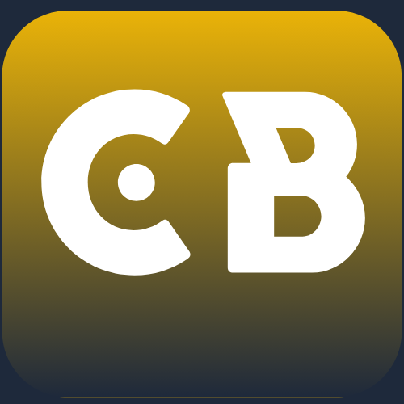

# Creative Blogger

## 🚀 Projet collaboratif entre bloggers 🚀

---

### ⌛ Prérequis :

> NodeJS ( des connaissances sont requises en NextJs, ou utilisez chatGPT ^^ )

> Un ordinateur

> Aller sur le site ( c'est important pour le référencement )

### 📋 Pour utiliser ce template

Si vous voulez utiliser ce template nous vous recommandons d'aller voir notre article : [comment créer un blog](http://creativeblogger.org/posts/creer-un-blog)
Ce template est libre d'utilisation ( comme on le dit dans l'article ). Vous devez simplement respecter la license de citer l'auteur et de ré-utiliser la même license.

### 🗺️ Notre roadmap

- [x] 08 / 05 / 2023 : Mise en ligne du site ( après plusieurs problèmes )
- [ ] ? / ? / ? : Mise en ligne du premier article
- [ ] ? / ? / ? : Création des comptes pour le projet sur les réseaux sociaux

### 📜 La license

License creative commons
Attribution 4.0 International (CC BY 4.0)
Pour plus d'infos : [lien de la license](https://creativecommons.org/licenses/by/4.0/deed.fr)

### 💖 Contributeurs

A Creative Blogger on aime :

> Maël C. : Fondateur & Dev & Rédacteur ( ouais je fais tout moi ! )

> Riccardo : Admin

> RedBoy : Admin

> Iandres : Admin
